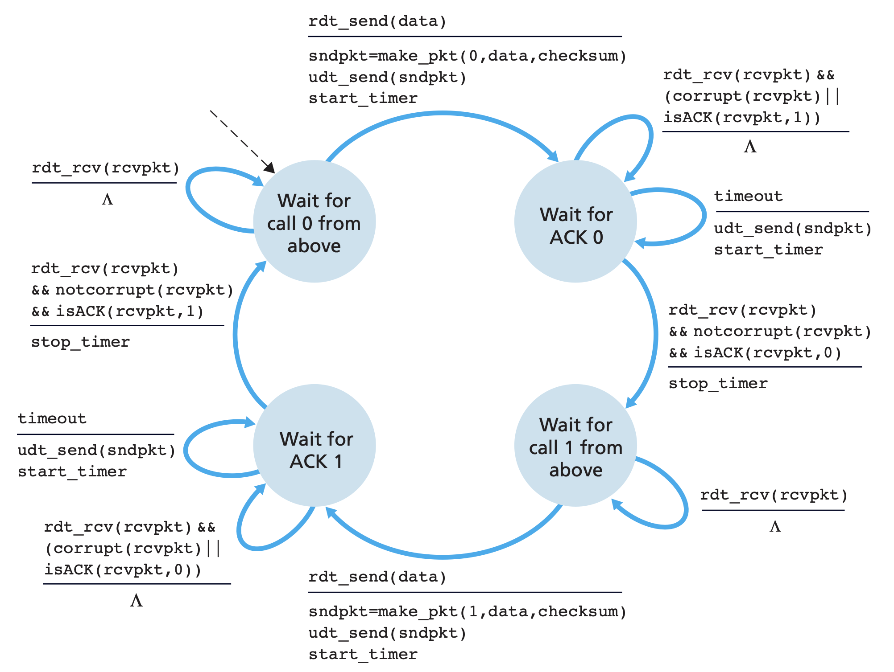
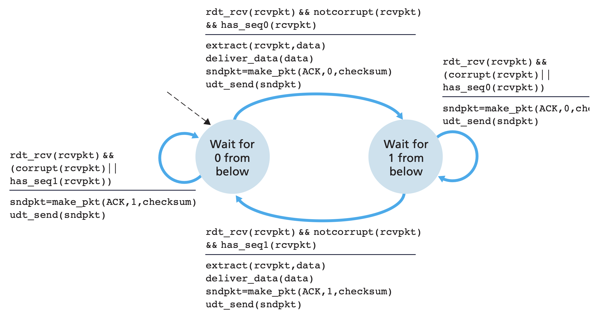

```{r setup, include=FALSE}
knitr::opts_chunk$set(echo = TRUE)
```

## Question 1: Reliable Data Transfer

#### Design the protocol state machines for S and R (both R1 and R2 should use the same protocol).

+ Using rdt3.0, a protocol that reliably transfers data over a channel that can corrupt or lose packets.

  * rdt_send(data)
  * Wait for ACK 0
  * rdt_rcv(rcvpkt) && (corrupt(rcvpkt) || isACK(rcvpkt,1))
  * rdt_rcv(rcvpkt) && notcorrupt(rcvpkt) && isACK(rcvpkt,0)
  * Wait for call 1 from above
  * rdt_send(data)
  * Wait for ACK 1
  * rdt_rcv(rcvpkt) && (corrupt(rcvpkt) || isACK(rcvpkt,0))
  * rdt_rcv(rcvpkt) && notcorrupt(rcvpkt) && isACK(rcvpkt,1)
  * Wait for call 0 from above

+ Sender: rdt3.0 sender which can judiciously choose a time value such that packet loss is likely, although not guaranteed, to have happened. If an ACK is not received within this time, the packet is retransmitted.

\newline

+ Receiver: rdt2.2 receiver which can use checksumming, sequence numbers, ACK packets, and retransmissions to handle packet loss.

\newline

## Question 2: Throttling

#### What is the difference between flow control and congestion control?

+ Flow Control is an end-to-end mechanism that controls the traffic between a sender and a receiver. Flow control occurs in the data link layer and the transport layer.

+ Congestion control is used to control congestion in the network. Congestion Control is handled by the network layer and the transport layer.

#### Describe the way TCP implements each of these features.

+ TCP provides flow control by having the sender maintain a variable called the receive window, which is used to give the sender an idea of how much free buffer space is available at the receiver. Because TCP is full-duplex, the sender at each side of the connection maintains a distinct receive window.

+ TCP provides congestion control by having each sender limit the rate at which it sends traffic into its connection as a function of perceived network congestion. If a TCP sender perceives that there is little congestion on the path between itself and the destination, then the TCP sender increases its send rate; if the sender perceives that there is congestion along the path, then the sender reduces its send rate.

## Question 3: NAT

#### What are possible values for the source and destination addresses and ports for packets?

                                          Source                        Destination
---------------------------------         -------------                 -------------
from A to X behind the NAT                10.0.0.1:1025 - 65365         1.2.3.4:80
from B to X behind the NAT                10.0.0.2:1025 - 65365         1.2.3.4:80
from A to X between the NAT and X         5.6.7.8:1025 - 65365          1.2.3.4:80
from B to X between the NAT and X         5.6.7.8:1025 - 65365          1.2.3.4:80
from X to A between X and the NAT         1.2.3.4:80                    5.6.7.8:1025 - 65365
from X to A between the NAT and A         1.2.3.4:80                    10.0.0.1:1025 - 65365

#### What there corresponding contents of the router's NAT translation table?

+ Port numbers

+ IP addresses

## Question 4: Routers

#### How many subnets are a part of this network, and what is the smallest IP prefix (i.e. most fixed bits) that can be used to describe each one?

+ 6 subnets.

+ A: 1.1.1

+ B: 1.1.2

+ C: 1.1.3

+ A/B: 1.1.4

+ A/C: 1.1.5

+ B/C: 1.1.6

#### If this network is somehow connected to the internet, what is the cheapest (i.e. smallest number of address) IP prefix the company could have purchased (without using NAT)?

+ 1.1.1 - 1.1.6

#### Assume the router for group A has 4 ports: port 1 is connected to the group subnet, port 2 is connected to router B, port 3 is connected to router C, and port D is connected to the ISP. Write out router A's forwarding table.

header value          output link
-------------         -------------
1.1.1                 A
1.1.4                 Router B
1.1.5                 Router C
1.1.7                 ISP

## Question 5: Routing

```
package msd.benjones;

import java.util.HashMap;
import java.util.HashSet;
import java.util.Set;

public class Router {

    private HashMap<Router, Integer> distances;
    private String name;
    public Router(String name) {
        this.distances = new HashMap<>();
        this.name = name;
    }

    public void onInit() throws InterruptedException {

		//TODO: IMPLEMENT ME
		//As soon as the network is online,
		//fill in your initial distance table and broadcast it to your neighbors
        
        HashSet<Neighbor> neighbors = Network.getNeighbors(this);

        // fill in initial distance table
        for (Router curRouter : Network.getRouters()) {
            if (curRouter == this) {
                distances.put(curRouter, 0);
            }
            else {
                distances.put(curRouter, Integer.MAX_VALUE);
            }
        }
        
        for (Neighbor curNeighbor : neighbors) {
            distances.put(curNeighbor.router, curNeighbor.cost);
        }
        
        // broadcast it to the neighbors
        for (Neighbor curNeighbor : neighbors) {
            Message message = new Message(this, curNeighbor.router, distances);
            Network.sendDistanceMessage(message);
        }
    }

    public void onDistanceMessage(Message message) throws InterruptedException {
		//update your distance table and broadcast it to your neighbors if it changed

        if (this == message.receiver) {
            for (Router curRouter : Network.getRouters()) {
                int curDistance = message.distances.get(curRouter) + this.distances.get(message.sender);

                if (message.distances.get(curRouter) != 0 &&
                    message.distances.get(curRouter) != Integer.MAX_VALUE &&
                    curDistance < this.distances.get(curRouter) && 
                    this.distances.get(message.sender) != 0) {

                    // broadcast it to your neighbors if it changed
                    this.distances.put(curRouter, curDistance);
                    
                    Message broadcast = new Message(this, curRouter, distances);
                    Network.sendDistanceMessage(broadcast);
                }
            }
        }
    }


    public void dumpDistanceTable() {
        System.out.println("router: " + this);
        for(Router r : distances.keySet()){
            System.out.println("\t" + r + "\t" + distances.get(r));
        }
    }

    @Override
    public String toString(){
        return "Router: " + name;
    }
}
```
