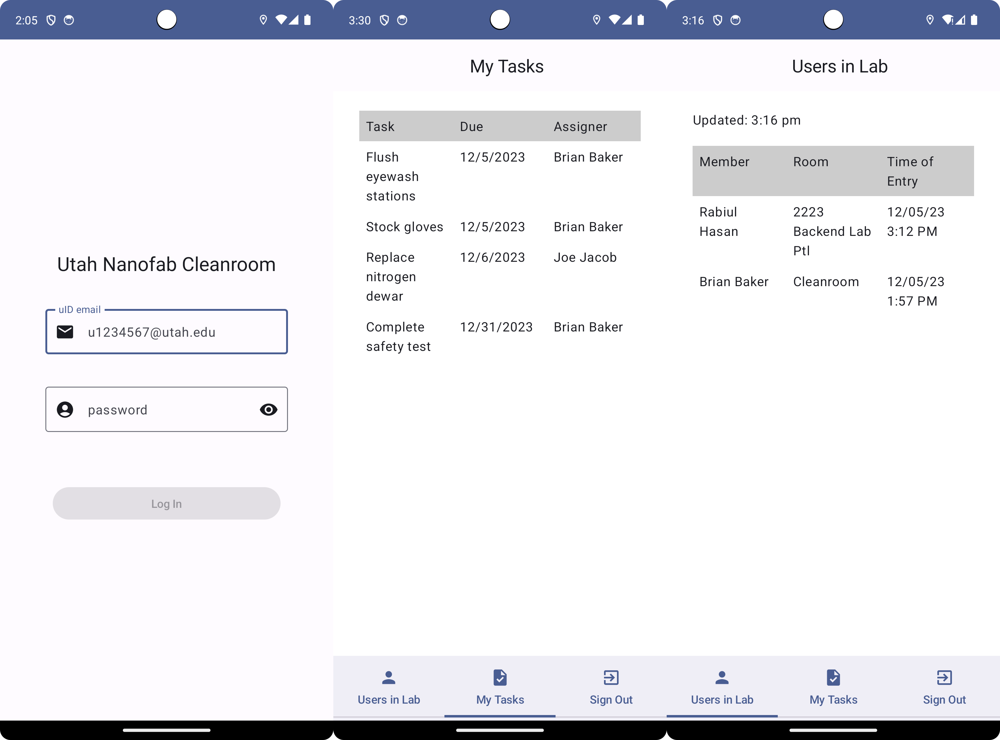

# Capstone Project Final Report

Muyuan Zhang

## Introduction

The Utah Nanofab cleanroom is the Utah Nanofab¡¯s fabrication and process design branch, involving nano-fabrication, nano-scale surface analysis, and industrial process design. It provides world-class equipment for lithography, deposition, etching, packaging, micro 3D printing, laser patterning, etc. As a software development and data science intern, I report to Brian Baker who is the cleanroom lab manager and staff process engineer.

This project uses data science tools and web crawling skills to fix security issues in the Utah Nanofab cleanroom.

### Monitor Run Data

Leverage the HSC database to send emails when certain events occur. For example, if a user has a run scheduled, they need to have a corresponding data entry log. If they fail to enter run data, the tool owner will be notified, and an email will be sent to the user to inform them that they can be disqualified from the tool because of the violation.

Denton 635 is equipment in the cleanroom that automates the sputter deposition of metals, alloys, and insulating thin films. Precious metals are used during the process, such as gold, silver, and platinum, so running the Denton 635 and not checking out precious metals is also a concern. Build a script to parse recipe names from CSV files and email notifications if a recipe with precious metal is used (Au, Pt, Ag, etc.). Cross-reference the recipe and the run data to filter the users who failed to check out.

Monitor run data for specific conditions and send the tool owner emails. For example, on the e-beam SJ20, if a user enters run data with a base pressure above 3.0E-6, flag it and send an email.

### Maintain ScreenLock

Maintain the ScreenLock program, which locks the screen of a Windows computer and only allows Coral (the website for tool reservation) to run in the foreground. All other programs are blocked by a large, transparent window. The program makes sure that the lab members cannot use any programs before they log in.

### Develop an Android App

Build and maintain an Android application to display the users in the lab. This allows the members to check the current status of any users who are working in the Nanofab cleanroom without visiting the Utah Nanofab website. If the user logs in as staff, they should be able to see the task lists that were assigned to them. Overdue tasks should be removed from the list.

## Background

The current approach to downloading the run data and reservation datasets is to manually download them from the websites every week. Since there are more than 10 pieces of equipment whose run data is monitored, such a procedure can be time-consuming and problematic. Instead of downloading the data manually, a script that can automatically download the run data and reservation datasets from Nanofab cleanroom websites should be developed.

In this project, multiple databases of different design patterns are involved to cross-reference the data. Lack of description of columns, huge efforts are required to figure out the meaning of each column, and data tidying could be complicated.

ScreenLock is required to be installed and maintained on every device in the cleanroom. Environment configuration needs to be completed when a new computer comes.

## Solution Description

The project includes the following components:

* Data crawling
* Data tidying
* ScreenLock maintenance
* Android application development

Project progress and design details are discussed in weekly meetings with the cleanroom manager. The code is committed to a GitHub repository so that the code version can be controlled using branches.

### Data Crawling

The data-crawling component is developed using TypeScript and Node.js in Visual Studio Code, involving the following libraries and testing methods:

* Axios: Make HTTP requests from node.js and intercept requests and responses.
* Node.js File System Module: Create and update files locally and in Google Drive.
* Google Drive API: Create and update files in Google Drive.
* ESLint: Fix syntax issues and configure with JavaScript code.
* Node.js Unit Testing

The script can automatically download run data and reservation datasets from the Nanofab cleanroom website and store them locally and in Google Sheets. A JSON object that enumerates the service code for each equipment allows switching among equipment.

The number of lines of code and languages are as shown in the following table:

| Number of Lines | File Type |
| --------------- | --------- |
| 273 | .ts |

### Data Tidying

The data-tidying component is developed using Python in PyCharm, involving the following library and testing methods:

* Pandas: Read .csv files, merge data frames and save results into .csv files.
* Pandas Testing
* numpy.testing

The program can tidy the raw datasets, combine them together, and filter the users who failed to check out the precious metals. First, filter the recipes that are related to precious metals and cross-reference the two datasets on `events.user_name` = `rundata.submitter`, and the time gap between `events.start_date` and `rundata.received_time` less than 2 hours. Then store the result data frame with columns `user_name` and `received_time`. Finally, generate notifications and send the emails to the tool owner.

The number of lines of code and languages are as shown in the following table:

| Number of Lines | File Type |
| --------------- | --------- |
| 1857 | .py |

### ScreenLock Maintenance

The application runs on Windows systems. It locks the screen of the computer and only allows Coral, which is the website for tool reservation, to run in the foreground. All other programs are blocked by a large, transparent window which prevents lab members from using any programs before they log in. I mainly worked on the installation and environment configuration.

The number of lines of code and languages are as shown in the following table:

| Number of Lines | File Type |
| --------------- | --------- |
| 2170 | .py |

### Android Application Development

The Android application component is developed using Kotlin in Android Studio, involving the following library and testing methods:

* Ktor: Build the server and create an HTTP API.
* Google Firebase: Support authentication on the login page.
* Android Jetpack: Implement components and screens in the application.
* Retrofit: Talk to the web service and display the raw JSON response as Strings.
* Android Unit Testing

After getting into the application, the user will be prompted to input their uID email and password. The information is then checked if the user exists in the database.

In the Users in Lab screen, the application gets the data from the Utah Nanofab website using the Retrofit library, and the data is stored using LiveData and ViewModel. The application will update the status of LiveData within the ViewModel using real data that it gets from the internet.

If the user logs in as staff, they can also access the task list that is assigned to them. Once a task passes its due, it will be removed from the task list.

The number of lines of code and languages are as shown in the following table:

| Number of Lines | File Type |
| --------------- | --------- |
| 1446 | .kt |

## Results

### Data Crawling and Tidying

The TypeScript program is run weekly. It automatically downloads the datasets from the Nanofab website and stores them locally and in Google Sheets. The raw datasets are combined, and the users who failed to check out the precious metals are filtered using the Python program. Email notifications are sent to the corresponding tool owners, which can save at least 2 hours per week for the Nanofab.

However, the TypeScript program requires Node.js 10+ in the environment where it runs. Switching between TypeScript and Python programs can be also confusing for users. I am still searching for approaches to combine the two parts into a single-click program.

### Android Application

The application allows members to log in as staff or members, and to receive live updates of the users in the lab. In the task list screen, tasks are sorted by due date and get removed from the list if overdue.

New features should be added to the application, such as checking/unchecking tasks, creating new tasks and assigning them to other staff, leaving notes on a task, etc.

## Conclusions

I had experience developing data tidying programs using Python Pandas in my previous work, which inspired me in this project that data tidying can be combined with data crawling to implement automatic data cleaning. Also, Android application development skills and tools in CS6018, such as Ktor, Google Firebase, and JetPack, are extremely helpful in implementing the functions in the project.

This project allowed me to experience the real industrial project process, including GitHub-based collaboration, project meetings, code maintenance, and code testing. Communicating with actual users allows me to understand customer needs, improve the UI interfaces, and optimize user experience.
